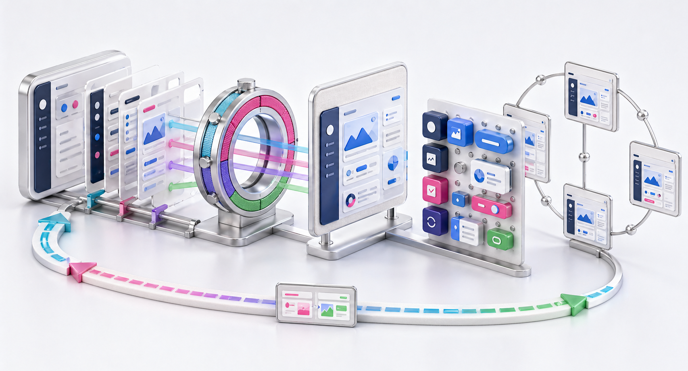

# Autonomous Concept UI Redesign Skill

<!-- README HERO START -->
<p align="center">
  
</p>

<p align="center">
  <strong>A standalone Codex skill for concept-led UI redesign, implementation, iteration, and visual QA.</strong>
</p>
<!-- README HERO END -->

Version: 0.1.0

Language note: This README uses an English-first bilingual structure. The Chinese section follows as a full mirror for Chinese readers.

语言说明：本 README 采用英文在前、中文在后的双语结构。中文部分是英文部分的完整对应版本。

## English

### Overview

This repository contains a standalone Codex skill for substantial UI redesign work. It turns fuzzy UI direction into a non-interactive end-to-end pipeline:

1. Inspect the existing product and preserve real workflows.
2. Define functional goals, user tasks, required data, required actions, required states, and non-goals.
3. Draft and review display elements before choosing visual style.
4. Set information architecture, presentation mode, content pressure, viewport/window contract, palette contract, and visual fidelity contract.
5. Generate and score multiple UI concept candidates when concept search is warranted.
6. Generate and gate app/software icon candidates when the product needs a desktop, mobile, packaged web, browser extension, or branded software identity.
7. Implement inside the existing architecture with `frontend-design`.
8. Iterate from rendered screenshots with `design-iterator` or a manual bounded loop.
9. Review implementation-vs-baseline deviations with `design-implementation-reviewer` or a manual equivalent.
10. Prove geometry, screenshot trust, pointer reachability, content/localization, app icon identity, and remaining risks before claiming completion.

The concept-led front half is built into this skill. It does **not** require the older `concept-led-ui-redesign` skill.

### When To Use It

Use this skill for:

- large UI redesigns with fuzzy visual direction;
- desktop, web, mobile, packaged app, dashboard, or tool surfaces where screenshot QA matters;
- app/software icon work that must become real window, taskbar, tray, dock, shortcut, installer, or package identity;
- redesigns where concept candidates should be tested before implementation;
- FlowPilot UI routes that need non-interactive design execution.

Do not use it for:

- tiny spacing, copy, or color tweaks;
- backend-only tasks;
- data/model work without a user-facing rendered surface;
- strict Figma implementation where a design file must be followed without generating a new concept direction.

### Companion Skills

The standalone skill owns the concept-led framing and QA references internally. It still composes these companion skills when the matching phase starts:

| Companion skill | Role | Source |
| --- | --- | --- |
| `frontend-design` | Implementation and first rendered visual sanity pass. | [`anthropics/skills/skills/frontend-design`](https://github.com/anthropics/skills/tree/main/skills/frontend-design) |
| `design-iterator` | Bounded screenshot-analyze-fix loops after first render. | [`ratacat/claude-skills/skills/design-iterator`](https://github.com/ratacat/claude-skills/tree/main/skills/design-iterator) |
| `design-implementation-reviewer` | Implementation-vs-baseline deviation review. | [`ratacat/claude-skills/skills/design-implementation-reviewer`](https://github.com/ratacat/claude-skills/tree/main/skills/design-implementation-reviewer) |

`imagegen` is treated as a host capability for bitmap concept images and app/software icon candidates. In Codex, it may be provided by the system `imagegen` skill; other hosts can map that capability to an equivalent image generation tool.

### Installation

Copy `autonomous-concept-ui-redesign/` into your Codex skills directory.

Windows PowerShell:

```powershell
Copy-Item -Recurse .\autonomous-concept-ui-redesign "$env:USERPROFILE\.codex\skills\"
```

macOS/Linux:

```bash
mkdir -p "$HOME/.codex/skills"
cp -R ./autonomous-concept-ui-redesign "$HOME/.codex/skills/"
```

After installation, invoke it in a future Codex session with a request like:

```text
Use $autonomous-concept-ui-redesign to redesign this existing UI from the current product structure, choose a grounded concept target, implement it, iterate from screenshots, review deviations, bind the app icon where applicable, and verify geometry plus real rendered evidence.
```

### Repository Contents

```text
autonomous-concept-ui-redesign/
  SKILL.md
  agents/openai.yaml
  references/
    concept-brief.md
    dependency-map.md
    design-search.md
    divergence-review.md
    functional-framing.md
    layout-geometry-qa.md
    platform-notes.md
    run-report-template.md
    visual-qa-loop.md
  scripts/
    app_icon_asset_check.py
```

### Public Boundary

This repository contains the reusable skill instructions, reference checklists, README hero asset, and app icon helper script. It does not contain local FlowPilot run state, private screenshots, user-specific knowledge records, generated route evidence, credentials, or machine-specific configuration.

### Release Notes

See `CHANGELOG.md`.

## 中文

### 概述

这是一个独立的 Codex skill，用于较大幅度的 UI 重设计工作。它把模糊的 UI 方向组织成一个非交互式端到端流程：

1. 检查现有产品，并保留真实工作流。
2. 定义功能目标、用户任务、必需数据、必需操作、必需状态和非目标。
3. 先草拟并审查显示元素，再选择视觉风格。
4. 确定信息架构、呈现模式、内容压力、窗口/视口合同、调色板合同和视觉保真合同。
5. 需要概念搜索时，生成并评分多组 UI concept 候选。
6. 当产品需要桌面、移动端、打包 Web、浏览器扩展或品牌软件身份时，生成并检查 app/software icon 候选。
7. 使用 `frontend-design` 在现有架构内实现。
8. 使用 `design-iterator` 或手动有限循环，根据渲染截图迭代。
9. 使用 `design-implementation-reviewer` 或手动等价流程审查实现与基准的偏差。
10. 在声明完成前，证明几何布局、截图可信度、鼠标可达性、内容/本地化、真实应用图标身份和剩余风险。

concept-led 的前半段已经内建在这个 skill 中。它**不再需要**旧的 `concept-led-ui-redesign` skill。

### 适用场景

适合：

- 视觉方向模糊的大型 UI 重设计；
- 需要截图 QA 的桌面、Web、移动端、打包应用、dashboard 或工具界面；
- app/software icon 必须真正成为窗口、任务栏、托盘、dock、快捷方式、安装器或包身份的工作；
- 实现前需要先比较 concept 候选的重设计；
- 需要非交互式设计执行的 FlowPilot UI 路线。

不适合：

- 很小的间距、文案或颜色微调；
- 纯后端任务；
- 没有用户可见渲染界面的数据/模型工作；
- 已有权威 Figma，且必须严格照做、不生成新概念方向的实现任务。

### 伴随技能

这个独立 skill 已经内建 concept-led 的功能框定和 QA 参考文件。对应阶段开始时，它仍会组合这些 companion skills：

| companion skill | 作用 | 来源 |
| --- | --- | --- |
| `frontend-design` | 实现和第一次渲染视觉 sanity pass。 | [`anthropics/skills/skills/frontend-design`](https://github.com/anthropics/skills/tree/main/skills/frontend-design) |
| `design-iterator` | 首次渲染后的有限轮截图-分析-修复循环。 | [`ratacat/claude-skills/skills/design-iterator`](https://github.com/ratacat/claude-skills/tree/main/skills/design-iterator) |
| `design-implementation-reviewer` | 实现与基准之间的偏差审查。 | [`ratacat/claude-skills/skills/design-implementation-reviewer`](https://github.com/ratacat/claude-skills/tree/main/skills/design-implementation-reviewer) |

`imagegen` 被视为生成 UI concept 位图和 app/software icon 候选的宿主能力。在 Codex 中，它可以由系统 `imagegen` skill 提供；其他宿主可以把这个能力映射到等价的图像生成工具。

### 安装

把 `autonomous-concept-ui-redesign/` 目录复制到 Codex skills 目录。

Windows PowerShell:

```powershell
Copy-Item -Recurse .\autonomous-concept-ui-redesign "$env:USERPROFILE\.codex\skills\"
```

macOS/Linux:

```bash
mkdir -p "$HOME/.codex/skills"
cp -R ./autonomous-concept-ui-redesign "$HOME/.codex/skills/"
```

安装后，在后续 Codex 会话中可以用类似请求触发：

```text
Use $autonomous-concept-ui-redesign to redesign this existing UI from the current product structure, choose a grounded concept target, implement it, iterate from screenshots, review deviations, bind the app icon where applicable, and verify geometry plus real rendered evidence.
```

### 仓库内容

```text
autonomous-concept-ui-redesign/
  SKILL.md
  agents/openai.yaml
  references/
    concept-brief.md
    dependency-map.md
    design-search.md
    divergence-review.md
    functional-framing.md
    layout-geometry-qa.md
    platform-notes.md
    run-report-template.md
    visual-qa-loop.md
  scripts/
    app_icon_asset_check.py
```

### 公开边界

这个仓库只包含可复用的 skill 指令、参考检查清单、README hero 资产和 app icon 辅助脚本。它不包含本地 FlowPilot run 状态、私人截图、用户专属知识记录、生成的路线证据、凭据或机器特定配置。

### 发布说明

见 `CHANGELOG.md`。
